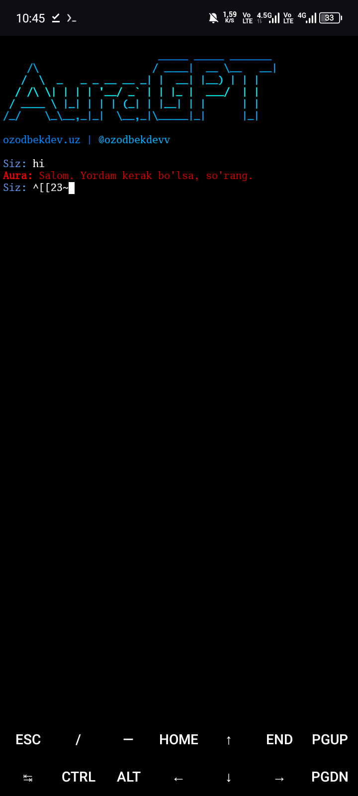

# AuraGPT - Ai in the Terminal
## bash:

```bash
git clone https://github.com/ozodbekdev-alfa/AuraGPT
cd AuraGPT
bash auraGPT.sh
```

[ozodbekdev.uz](https://ozodbekdev.uz)      [telegram](https://t.me/ozodbekdevv)


 
